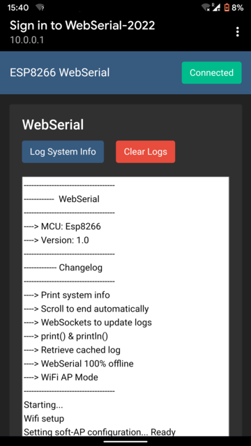
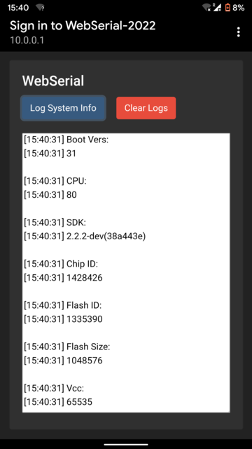

# WebSerial ESP-8266

ESP8266 Remote Serial Monitor

### Hardware used

* ESP-01S (ESP-8266)

### Features

* WiFi in AP mode (Hotspot mode)
* WebSockets to broadcast logs
* WebServer to handle HTTP Requests from clients
* Web Interface 100% Offline
* Web Captive Portal

### Screenshots
 
 
